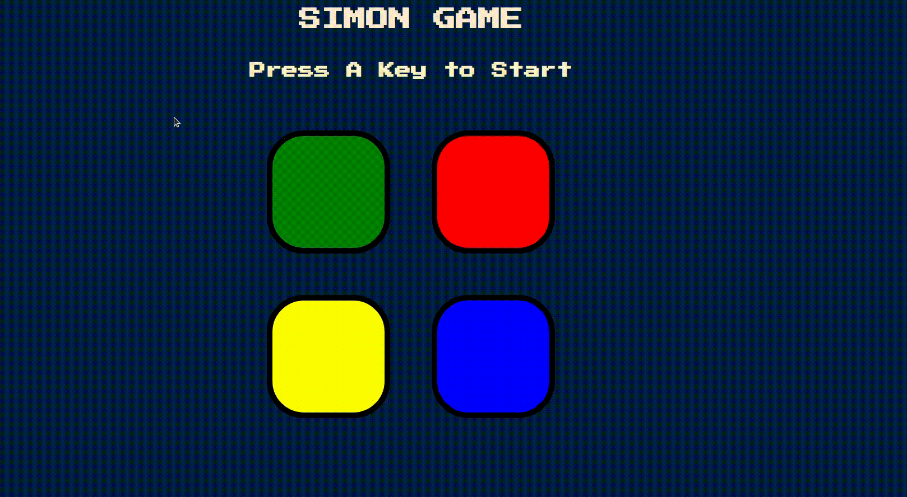
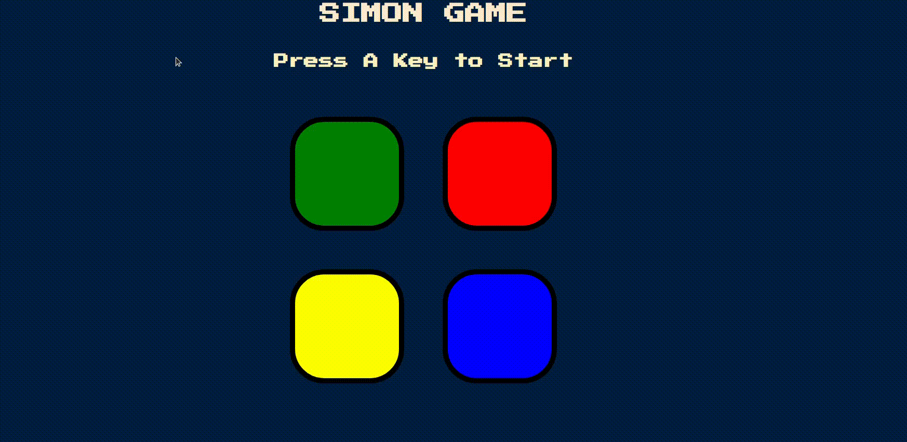

# SIMON GAME

> This web-game is created based on the **Simon game.**
This project is one of the assignments in **Angela YU WEBDEV** course.

## How to Play

1. Intially, the game starts by flashing a color button.

2. The **User** need to press the color button.

3. Next,a button flashes again.

4. The **User** need to press the **first** button and the **recent** button in the **sequence.**

5. This game continues as long as the **User** can repeat the sequence.

6. The **Levels** will be incremented as long as **User** managed to press the buttons according to sequence.

6. If the **User** clicks a **wrong** button, the sequence is distorted and the game is over.

7. The **User** can restart the game.

## Languages and Libraries :
- HTML
- CSS
- JavaScript
- jQuery 

### Feel free to contribute/fix bugs in the project.
